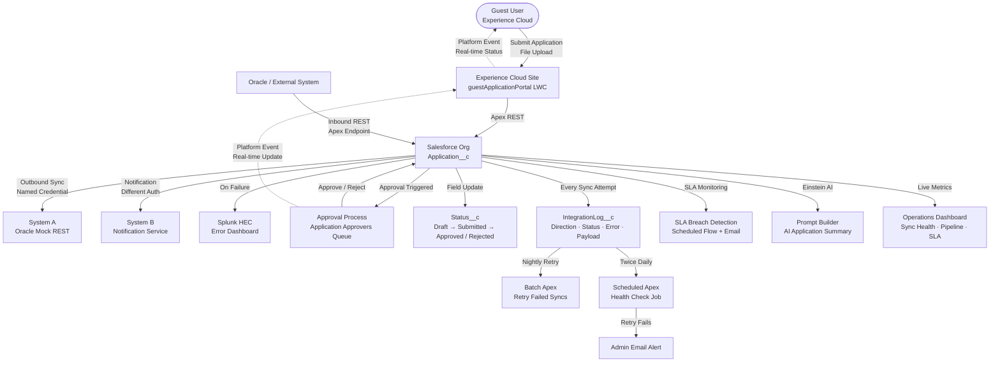

# SF Integration Platform
### Enterprise Salesforce–Oracle Sync, Application Approval & AI-Powered Operations


> Built by **[Aman Hashmi]** · [LinkedIn](https://www.linkedin.com/in/hashmi-aman/) · [GitHub](https://github.com/amanhashmi97/sf-integration-platform)

**🌐 Live Demo:** [Guest Application Portal](https://sf-integration-platform-dev-ed.develop.my.site.com/portal/)

---

## 📌 Overview

A production-grade Salesforce platform demonstrating enterprise integration patterns, approval workflows, AI-powered operations, and guest-facing portals. Built to mirror real-world L3 production engineering work at scale — covering the full Salesforce stack from data model to UI to integration to AI.

**Core capabilities:**
- Bi-directional Salesforce ↔ Oracle sync via REST + Named Credentials
- Custom reliability layer with retry logic, error logging, and admin alerts
- Full application approval lifecycle with record locking and sharing model
- Guest user portal (Experience Cloud) for external application submission
- Real-time status updates via Platform Events
- SLA breach detection with automated email alerts
- AI-powered application summary using Einstein Prompt Builder + Claude AI
- Live operations dashboard with sync health monitoring

---

## 🏗️ Architecture



---

## 🔧 Technical Stack

| Layer | Technology |
|---|---|
| Platform | Salesforce Developer Edition |
| Backend | Apex · Batch Apex · Scheduled Apex · Queueable · REST Callouts |
| Frontend | Lightning Web Components · Experience Cloud · Dynamic Actions |
| Integration | Named Credentials · HTTP Callouts · JSON Parsing · Platform Events |
| Automation | Record-Triggered Flow · Screen Flow · Scheduled Flow · Approval Process |
| AI | Einstein Prompt Builder · Claude AI (Anthropic) · ConnectApi.EinsteinLLM |
| Security | OWD Private · Permission Sets · Group-Based Sharing · Guest User Context |
| Monitoring | IntegrationLog__c · Operations Dashboard · SLA Breach Detection |
| Files | ContentVersion · FirstPublishLocationId · Queueable File Processing |
| Tools | Salesforce DX · VS Code · Git · GitHub |

---

## 📦 Project Modules

### 1. Outbound Integration (Salesforce → External Systems)

- **System A (Oracle)** — REST callout via Named Credential, payload construction, JSON response parsing
- **System B (Notification)** — separate auth pattern, different endpoint structure
- **Splunk HEC** — every sync failure logged to Splunk dashboard via HTTP callout
- **Per-status error handling** — 401, 404, 500, timeout each handled differently
- **IntegrationLog__c** — custom observability object logging every attempt

**Key files:**
```
force-app/main/default/classes/
├── ApplicationIntegrationService.cls
├── ApplicationIntegrationOrchestrator.cls  
└── IntegrationLogService.cls
```

---

### 2. Inbound Integration (External System → Salesforce)

- Apex REST endpoint receives Account/Contact data from Oracle
- Field mapping layer translates Oracle field names → Salesforce field names
- Duplicate detection via External ID — upsert instead of blind insert
- Partial success handling — `Database.insert(allOrNone=false)` per-record logging

**Key files:**
```
force-app/main/default/classes/
├── ApplicationInboundAPI.cls
```

---

### 3. Reliability Layer

- **IntegrationLog__c** — logs direction, system, status, error, payload, retry count, timestamp
- **Batch Apex** — nightly retry of all failed outbound syncs
- **Scheduled Apex** — runs twice daily, health check updating sync status
- **Admin email alert** — triggered when retry also fails
- **SLA Breach Detection** — Scheduled Flow monitors 72hr SLA, sends HTML email alert

**Key files:**
```
force-app/main/default/classes/
├── ApplicationRetryBatch.cls
├── ApplicationRetryScheduler.cls

force-app/main/default/flows/
└── SLA_Breach_Email_Alert.flow-meta.xml
```

---

### 4. Application Approval System

- **Data model** — `Application__c` status flow: `Draft → Submitted → Approved / Rejected`
- **Security** — OWD Private, group-based sharing, record locking on submission
- **Approval Process** — Initial/Final actions, email alerts, field updates
- **ApprovalActionPanel LWC** — inline approve/reject with mandatory rejection comments
- **Dynamic Actions** — profile-based button visibility, Submit for Approval on highlights panel
- **Banner LWC** — dynamic status messages with SLA breach warnings
- **Custom Labels** — all static messages externalized for translation support

**Key files:**
```
force-app/main/default/
├── classes/
│   ├── ApplicationSubmissionService.cls
│   ├── ApprovalActionController.cls
│   └── ApprovalHelper.cls
└── lwc/
    ├── approvalActionPanel/
    ├── approverBanner/
    └── submitApplicationQuickAction/
```

---

### 5. Guest User Portal (Experience Cloud)

- Public Experience Cloud site — no login required
- Mock login via name + email — email used as session identifier
- Account search with 300ms debounce — finds existing accounts or creates new
- File upload with 2MB limit — stored via `FirstPublishLocationId` pattern
- Duplicate detection — returning user sees current application status
- Resubmission flow — rejected applications can be resubmitted with new documents
- Real-time status via Platform Events — no page refresh needed
- Static status messages per status (Draft/Submitted/Approved/Rejected)

**Key files:**
```
force-app/main/default/
├── classes/
│   ├── GuestApplicationController.cls
│   └── SystemFileUpload.cls
└── lwc/
    ├── guestApplicationPortal/
    ├── portalHeader/
    └── portalFooter/
```

**Live site:** `https://sf-integration-platform-dev-ed.develop.my.site.com/portal/`

---

### 6. Platform Events — Real-time Updates

- `Application_Status_Change__e` platform event
- Published on approval action (approve/reject)
- Published on guest resubmission
- Guest portal subscribes via `lightning/empApi` — status updates live
- Admin approval panel subscribes — refreshes when guest resubmits

**Key files:**
```
force-app/main/default/
├── objects/Application_Status_Change__e/
└── lwc/
    ├── guestApplicationPortal/ (subscriber)
    └── approvalActionPanel/ (subscriber)
```

---

### 7. AI-Powered Application Summary

- Einstein Prompt Builder template — `Application_AI_Summary`
- Uses `sfdc_ai__DefaultBedrockAnthropicClaude45Opus` model natively
- Apex invokes via `ConnectApi.EinsteinLLM.generateMessagesForPromptTemplate`
- Auto-loads on record open + manual refresh button
- Analyzes: application details, integration logs, approval history
- Returns professional 3-4 sentence summary with risk flags and recommendations
- Visible to admin only via App Builder visibility rules

**Key files:**
```
force-app/main/default/
├── classes/
│   └── AISummaryController.cls
├── lwc/
│   └── applicationAISummary/
└── genAiPromptTemplates/
    └── Application_AI_Summary.genAiPromptTemplate-meta.xml
```

---

### 8. Operations Dashboard

- Native Salesforce Dashboard with 9 widgets
- **Sync Success Rate** — donut chart by status
- **Total/Failed/Successful Syncs** — metric widgets
- **Reliability by System** — stacked bar (Oracle, System B, Splunk)
- **Failure Breakdown by Direction** — grouped bar (Inbound vs Outbound)
- **Application Pipeline** — donut by status with amount sum
- **Guest vs Internal Submissions** — grouped bar
- **SLA Breached Applications** — table with breach dates
- **Breaching Soon** — upcoming SLA breaches within 2 days
- **Recent Sync Errors** — latest failed logs table
- Dashboard filters — Date Range, System, Direction

---

## 🔒 Security Model

| Layer | Implementation |
|---|---|
| OWD | Private — users see only their own records |
| Approver access | Manual sharing via `Application__Share` + Public Group |
| Guest access | `without sharing` Apex — scoped by email, no Id exposure |
| Admin actions | Permission Set + Dynamic Action visibility rules |
| Record locking | Enabled on approval submission |
| Field validation | Blocks edit after submission, admin bypass via Custom Permission |
| File ownership | `FirstPublishLocationId` bypasses private library restriction |
| Guest file upload | Queueable Apex runs in system context |

---

## ⚡ Governor Limits Handling

```apex
// Bulk-safe approval processing — one SOQL, one DML, one approval call
Approval.process(List<Approval.ProcessWorkitemRequest>);

// Upsert with External ID — duplicate prevention
upsert records ExternalId__c;

// Static caching — prevents repeated SOQL in same transaction
private static Id cachedGroupId;

// Partial success — per-record logging
Database.insert(records, false); // allOrNone = false

// Async file processing — avoids heap limit
System.enqueueJob(new SystemFileUpload.FileUploadJob(docId));

// FirstPublishLocationId — single DML for file + link
ContentVersion cv = new ContentVersion(
    FirstPublishLocationId = appId
);
```

---

## 🤖 AI & Einstein Features

| Feature | Implementation |
|---|---|
| AI Application Summary | Einstein Prompt Builder + Claude 4.5 Opus |
| Prompt Template | Record type, Application__c merge fields |
| Invocation | ConnectApi.EinsteinLLM.generateMessagesForPromptTemplate |
| Data analyzed | Application details + Integration logs + Approval history |
| Output | 3-4 sentence professional summary, plain text |
| Trigger | Auto-load on record open + manual refresh |
| Visibility | Admin only via App Builder rules |

---

## 🚀 Setup & Deployment

### Prerequisites
- Salesforce Developer Edition org
- Salesforce CLI (`sf`) installed
- VS Code + Salesforce Extension Pack
- Anthropic API key (for AI Summary via Named Credential)

### Deploy
```bash
# Authenticate
sf org login web --alias my-org

# Deploy all metadata
sf project deploy start --source-dir force-app

# Run all tests
sf apex run test --test-level RunLocalTests --result-format human
```

### Post-deployment configuration
1. Create Custom Label: `Approver_Group_Name` → your approver group developer name
2. Activate Approval Process
3. Activate all Flows
4. Assign Page Layouts and Lightning Record Pages
5. Configure Named Credentials for System A, System B, Splunk
6. Enable Experience Cloud site → set guest profile permissions
7. Schedule Apex jobs:
```apex
System.schedule('Health Check', '0 0 0,12 * * ?', new ApplicationRetryScheduler());
System.schedule('SLA Check', '0 0 9 * * ?', new SLABreachScheduler());
```
8. Configure Einstein → Prompt Builder → activate `Application_AI_Summary` template
9. Enable Platform Events on Experience Cloud site

---

## 📊 Reporting & Monitoring

| Report | Type | Purpose |
|---|---|---|
| Sync Success Rate | Summary/Donut | Overall sync health |
| Inbound vs Outbound Failures | Summary/Bar | Direction-based failure analysis |
| Per-System Reliability | Summary/Stacked Bar | System-level performance |
| Application Status Overview | Summary/Donut | Pipeline visibility |
| Guest vs Internal Submissions | Summary/Bar | Channel breakdown |
| SLA Breached Applications | Tabular/Table | Immediate action required |
| Upcoming SLA Breach | Tabular/Table | Proactive monitoring |
| Recent Sync Errors | Tabular/Table | Error drill-down |

---

## 🏆 Key Technical Patterns

### Integration
- Named Credentials for secure endpoint management
- Per-status error handling (401, 404, 500, timeout)
- Retry logic with exponential backoff pattern
- Inbound upsert with External ID deduplication
- Partial success with per-record logging

### LWC
- `@wire` reactive data binding with `refreshApex`
- `empApi` Platform Event subscription
- `FileReader` API for base64 file handling
- Debounced search (300ms setTimeout pattern)
- Dynamic CSS computed getters
- `FirstPublishLocationId` for guest file upload

### Apex
- Bulk-safe patterns throughout — no SOQL/DML in loops
- `without sharing` for guest context
- `ConnectApi.EinsteinLLM` for AI invocation
- `Approval.process(List<>)` bulk approval
- `Database.insert(allOrNone=false)` partial success
- Static variable caching for governor efficiency

### Automation
- Record-Triggered Flow — guest auto-submission
- Scheduled Flow — SLA breach email alerts
- Approval Process — full lifecycle management
- Dynamic Actions — profile/status-based visibility
- Custom Labels — all static text for translation support
- Email Templates — HTML with Custom Label merge fields

---

## 🧪 Test Classes

| Class | Coverage |
|---|---|
| GuestApplicationControllerTest | In progress |
| ApprovalActionControllerTest | In progress |
| ApplicationSubmissionServiceTest | In progress |
| ApprovalHelperTest | In progress |
| AISummaryControllerTest | Pending |
| IntegrationHealthControllerTest | Pending |
| SystemFileUploadTest | Pending |

## 👤 Author

**[Aman Hashmi]**
Salesforce Developer · 4+ Years · Tata Consultancy Services

**Certifications:**
- Salesforce Certified Administrator
- Salesforce AI Specialist
- Salesforce AI Associate

**Awards:**
- Star of the Month 2025 — TCS
- TCS Innovation Award — tcsAI Spark 2025
- On-The-Spot Award (Multiple) 2022–2025

[](https://www.linkedin.com/in/hashmi-aman/)
[](https://github.com/amanhashmi97/sf-integration-platform)

---

*Built with ☁️ on Salesforce · Powered by 🤖 Einstein AI · © 2026 [Aman Hashmi]*